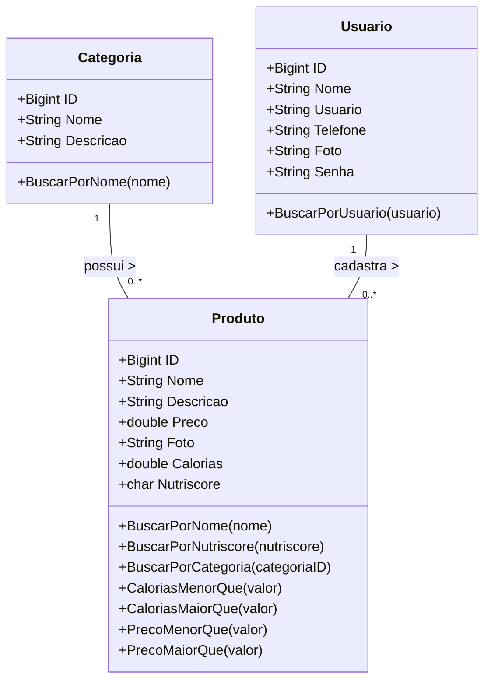
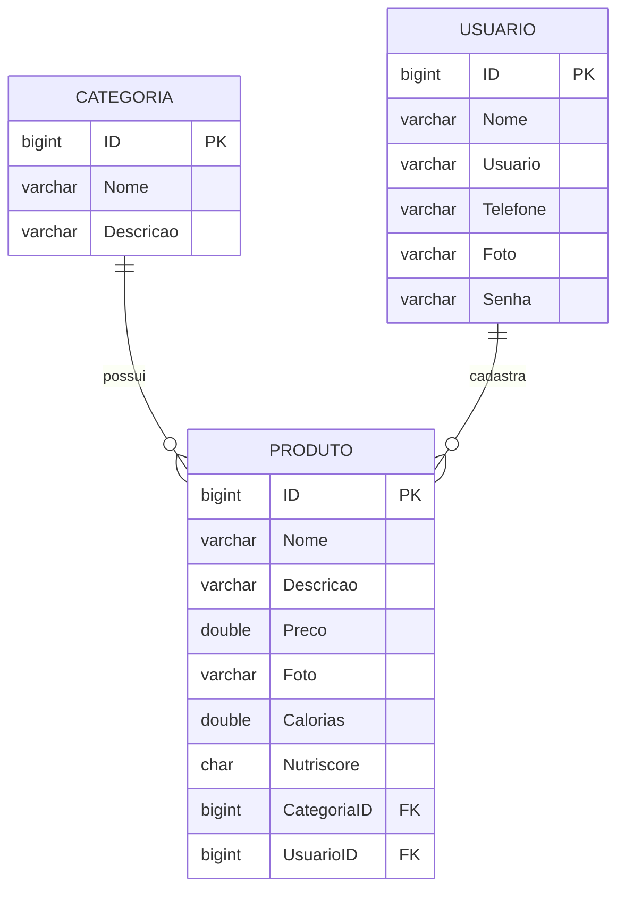

<div align="center">

# DeliveyBro - Backend


</div>
<br />

<div align="center">
    
</div>

---

## Descrição

RideBro é uma API REST em Java com Spring Boot focada no gerenciamento de caronas, permitindo o cadastro de usuários, veículos e viagens.

---

## Sobre esta API

O RideBro é o núcleo de um sistema de gerenciamento de caronas. Desenvolvida com Java e Spring Boot, ela tem como objetivo facilitar a organização de viagens compartilhadas entre usuários, permitindo o cadastro de veículos, controle de usuários e gerenciamento de caronas. A arquitetura modular da API permite fácil manutenção e expansão.

Principais Funcionalidades
🚗 Cadastro e gerenciamento de veículos
Permite criar, editar, listar e excluir veículos utilizados nas caronas.

🧭 Gerenciamento de viagens
Os usuários podem cadastrar, consultar e organizar caronas com origem, destino e horários definidos.

👥 Controle de usuários
Cada carona pode ser associada a um usuário motorista ou passageiro (quando implementado).

🔗 API RESTful com arquitetura MVC
Estrutura organizada em camadas (Model, Controller, Service e Repository) seguindo boas práticas.

📄 Documentação com Swagger
Endpoints documentados para facilitar testes e integração com outras aplicações.

🔧 Base para futuras expansões
Preparada para receber funcionalidades como autenticação, reservas e avaliações de usuários.

---

## Diagrama de Classes



---

## Diagrama Entidade-Relacionamento (DER)



---

## API Endpoints

A API fornece os seguintes endpoints:

**GET EXERCICIOS**

```markdown
GET /exercicio - Recuperar uma lista de todos exercicios.
```

```json
[
  {
    "id": 1,
    "nome": "Treino Ombro",
    "carga": 20,
    "repeticoes": 12,
    "series": 3
  },
  {
    "id": 3,
    "nome": "Treino teste",
    "carga": 20,
    "repeticoes": 15,
    "series": 3
  }
]
```

**POST EXERCICIOS**

```markdown
POST /exercicio - Registra um novo exercício no aplicativo
```

```json
{
  "nome": "Treino Braço e perna",
  "carga": 20,
  "repeticoes": 12,
  "series": 3
}
```

**UPDATE EXERCICIOS**

```markdown
PUT /exercicio - Atualiza um exercicio existente
```

```json
{
  "id": 32,
  "nome": "Treino teste",
  "carga": 20,
  "repeticoes": 15,
  "series": 3
}
```

---

## Tecnologias utilizadas

| Item                          | Descrição        |
| ----------------------------- | ---------------- |
| **Servidor**                  | Tomcat           |
| **Linguagem de programação**  | Java             |
| **Framework**                 | Spring Framework |
| **ORM**                       | Hibernate        |
| **Banco de dados Relacional** | MySQL            |

---

## Configuração e Execução

1. Clone o repositório:
   ```bash
   git clone https://github.com/seu-usuario/ridebro-spring.git
   ```
2. Acesse a pasta do projeto:
   ```bash
   cd ridebro-spring
   ```
3. Configure o banco de dados:
   - Edite o arquivo application.properties ou application.yml na pasta src/main/resources
   - Defina as configurações do banco de dados (URL, usuário, senha)
4. Compile o projeto com Maven ou Gradle:

   Maven:

   ```bash
   mvn clean install
   ```

5. Execute a aplicação::
   Maven:
   ```bash
   mvn spring-boot:run
   ```
6. Acesse a API em:

   ```bash
   http://localhost:8080/swagger-ui.html
   ```

7. Use ferramentas como Insomnia ou Postman para testar os endpoints.

## Contribuições

Contribuições são sempre bem-vindas! Se você encontrar algum problema ou tiver sugestões para melhorias, por favor, abra uma issue ou envie um pull request para o repositório.

Ao contribuir, siga o estilo de código já existente e as convenções de commits. Por favor, envie suas alterações em uma branch separada.
