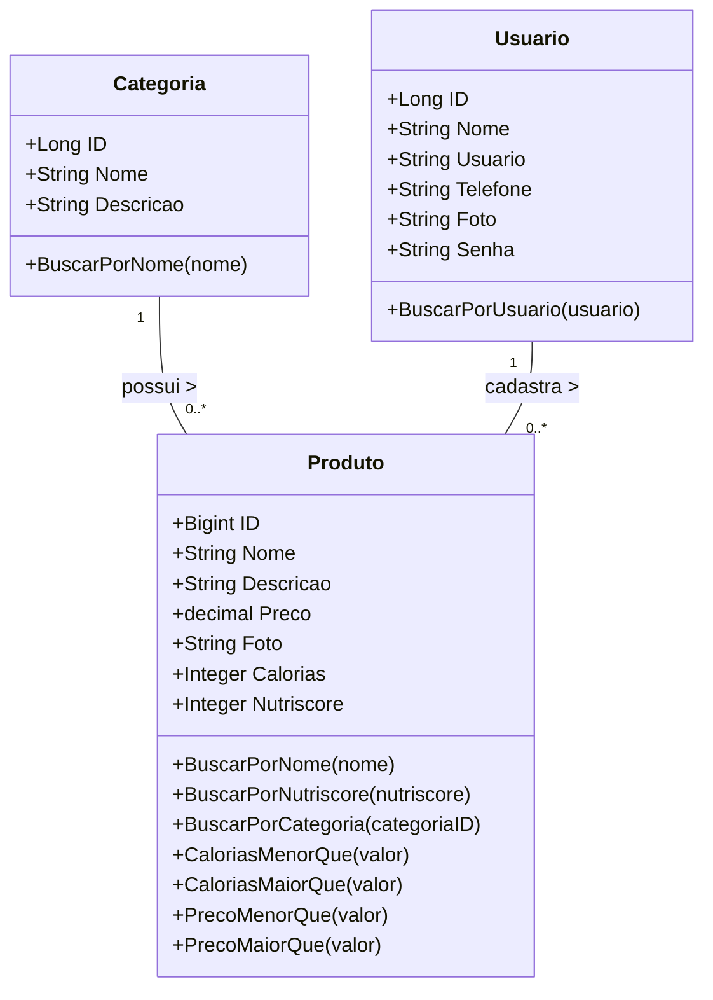
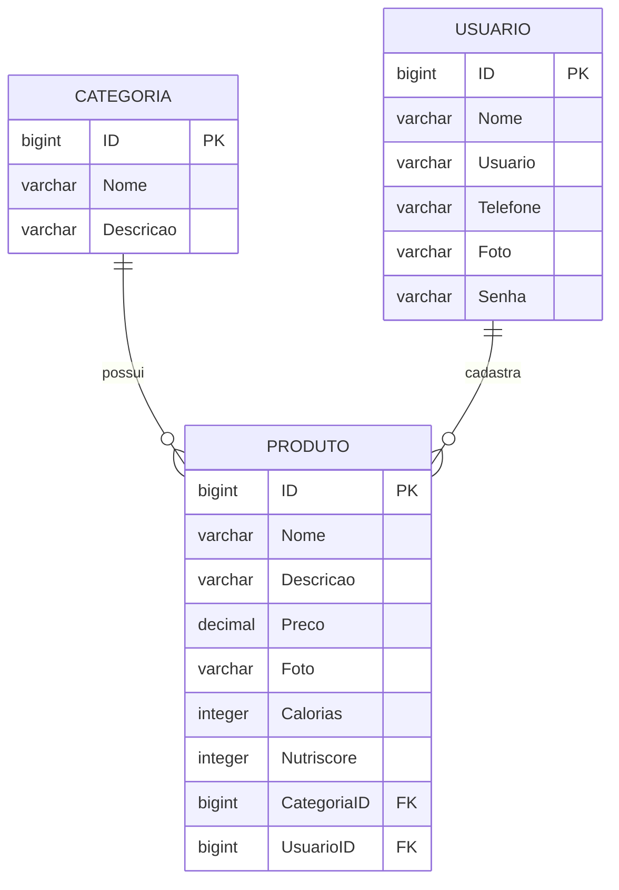

<div align="center">

# GetFood - Backend


[](https://swagger.io/)


</div>
<br />

<div align="center">
    
</div>

---

## 🍽️ Descrição

**GetFood** é uma API REST desenvolvida em Java com Spring Boot, voltada para o gerenciamento de pedidos em um sistema de delivery. Ela permite o cadastro de restaurantes, produtos e usuários, além de gerenciar pedidos e entregas de forma eficiente.

---

## 📦 Sobre esta API

O **GetFood** serve como o núcleo de um sistema de gerenciamento de delivery. Desenvolvida com Java, Spring Boot e arquitetura RESTful, a API tem como foco facilitar o fluxo de pedidos online entre clientes, restaurantes e entregadores. Sua estrutura modular garante fácil manutenção e escalabilidade para novas funcionalidades.

### Principais Funcionalidades

🍔 **Cadastro e gerenciamento de produtos**  
Restaurantes podem adicionar, editar, listar e excluir itens do cardápio.

🏪 **Gerenciamento de restaurantes**  
Cadastro de restaurantes com informações básicas, horários de funcionamento e cardápio.

🛒 **Pedidos e entregas**  
Usuários podem realizar pedidos, acompanhar o status e consultar o histórico.

👤 **Controle de usuários**  
Gerenciamento de clientes e administradores com autenticação integrada.

🔗 **API RESTful com arquitetura MVC**  
Organizada em camadas (Model, Controller, Service e Repository), seguindo boas práticas de desenvolvimento.

📄 **Documentação com Swagger**  
Todos os endpoints estão documentados para facilitar testes e integração com sistemas externos.

🔧 **Base para futuras expansões**  
Preparada para futuras funcionalidades como avaliações, promoções, pagamentos e suporte a múltiplas formas de entrega.

---

## Diagrama de Classes



---

## Diagrama Entidade-Relacionamento (DER)



---

## Exemplo de Endpoints

**GET CATEGORIA**

```markdown
GET / categoria - Recuperar uma lista de todas as categorias.
```

```json
[
{
	"id": 1,
	"nome": "Categoria de Teste",
	"descricao": "Categoria dedicada testes."
}
]
```

**POST CATEGORIAS**

```markdown
POST /categoria - Registra uma nova categoria no aplicativo
```

```json
{
	"nome": "Categoria de Teste",
	"descricao": "Categoria dedicada testes."
}
```

**UPDATE CATEGORIAS**

```markdown
PUT /categoria - Atualiza uma categoria existente
```

```json
{
  "id": 1,
  "nome": "Categoria de Teste 1",
  "descricao": "Atualização categoria dedicada testes."
}
```

---

## Tecnologias utilizadas

| Item                         | Descrição        |
|------------------------------|------------------|
| **Servidor**                 | Render           |
| **Linguagem de programação** | Java             |
| **Framework**                | Spring Framework |
| **ORM**                      | Hibernate        |
| **Banco de dados Relacional**| PostgreSQL       |
| **Banco na Nuvem**           | Neon             |
| **Documentação da API**      | Swagger          |


---

## 🚀 Acesso à Aplicação

🔗 [Acesse a API em produção](https://delivery-spring-deploy.onrender.com/)

- **Email:** `root2@email.com`  
- **Senha:** `rootroot`

## Como executar localmente:

1. Clone o repositório:
   ```bash
   git clone https://github.com/seu-usuario/delivery-spring.git
   ```
2. Acesse a pasta do projeto:
   ```bash
   cd delivery-spring
   ```
3. Configure o banco de dados:
   - Edite o arquivo application.properties ou application.yml na pasta src/main/resources
   - Defina as configurações do banco de dados (URL, usuário, senha)
4. Compile o projeto com Maven ou Gradle:

   Maven:

   ```bash
   mvn clean install
   ```

5. Execute a aplicação::
   Maven:
   ```bash
   mvn spring-boot:run
   ```
6. Acesse a API em:

   ```bash
   http://localhost:8080/swagger-ui.html
   ```

7. Use ferramentas como Insomnia ou Postman para testar os endpoints.

## Contribuições

Contribuições são sempre bem-vindas! Se você encontrar algum problema ou tiver sugestões para melhorias, por favor, abra uma issue ou envie um pull request para o repositório.

Ao contribuir, siga o estilo de código já existente e as convenções de commits. Por favor, envie suas alterações em uma branch separada.
